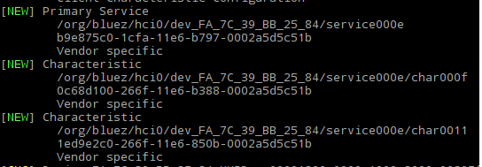

# Install

1. Go to [BlueZ download site](http://www.bluez.org/download/)
2. Copy the link of the version you want (e.g. http://www.kernel.org/pub/linux/bluetooth/bluez-5.50.tar.xz)
3. In Raspberry Pi use the command `gwet http://www.bluez.org/download/`
4. `tar xvf bluez...`
5. `cd bluez...`
6. `sudo apt-get install libglib2.0-dev libdbus-1-dev libudev-dev libical-dev libreadline-dev`
7. `./configure`
8. `make`
9. `sudo make install`
10. `sudo systemctl status bluetooth`
11. `sudo nano /lib/systemd/system/bluetooth.service`
12. Add to the line ExecStart=... the --experimental flag 
    Should be like `ExecStart=/usr/local/libexec/bluetooth/bluetoohd --experimental`
13. Restart the bluetooth service (I dont remember exactly the command, but when you use `sudo systemctl status bluetooth` now should show the flag --experimental


# Using BluetoothCtl

## Connecting to device

1. `sudo bluetoothctl`
2. `power on`
3. `scan on` then wait few seconds and turn off `scan off`
4. find the MAC of the device you want to connect
5. `connect <MAC>`

## Write and Read 

With the device connected

6. `menu gatt`
7. `list-attributes`
8. find the right attribute you want, there is probably one for writting and other for reading

    For this XDK example, we know that:
    
    1ed9e2c0-266f-11e6-850b-0002a5d5c51b is the UUID to read the service value
    
    
    0c68d100-266f-11e6-b388-0002a5d5c51b is the UUID to write to the service




9. `select-attribute <attribute>`

    For write to the XDK BLE application, for example, you should select 
    `select-attribute /org/bluez/hci0/dev_FA_7C_39_BB_25_84/service000e/char000f`
    
    And then use `write 0x30` (write 0 in hex)
    
    For read to the XDK BLE application, for example, you should select 
    `select-attribute /org/bluez/hci0/dev_FA_7C_39_BB_25_84/service000e/char0011`
    
    And then use `read`


## Bluepy

Installation  (Python2)

```
sudo apt-get install python-pip libglib2.0-dev
sudo pip install bluepy
```

Installation  (Python3)

```
sudo apt-get install python3-pip libglib2.0-dev
$sudo pip3 install bluepy
```
