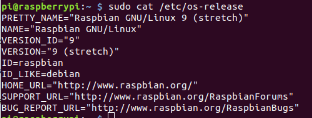

# Install

Follow all these steps: [Deploying BlueZ v5.50 on Raspberry Pi3](https://3pl46c46ctx02p7rzdsvsg21-wpengine.netdna-ssl.com/wp-content/uploads/2019/03/T1804_How-to-set-up-BlueZ_LFC_FINAL-1.pdf?utm_campaign=developer&utm_source=internal&utm_medium=blog&utm_content=Deploying-BlueZ-v5.50-on-Raspberry-Pi3-Update)

The version used for the scripts of the Raspberry Pi is




(NOOBS Stretch/Buster)

# Using BluetoothCtl

## Connecting to device

1. `sudo bluetoothctl`
2. `power on`
3. `scan on` then wait few seconds and turn off `scan off`
4. find the MAC of the device you want to connect
5. `connect <MAC>`

## Write and Read 

With the device connected

6. `menu gatt`
7. `list-attributes`
8. find the right attribute you want, there is probably one for writting and other for reading

    For this XDK example, we know that:
    
    1ed9e2c0-266f-11e6-850b-0002a5d5c51b is the UUID to read the service value
    
    
    0c68d100-266f-11e6-b388-0002a5d5c51b is the UUID to write to the service


9. `select-attribute <attribute>`

    For write to the XDK BLE application, for example, you should select 
    `select-attribute /org/bluez/hci0/dev_FA_7C_39_BB_25_84/service000e/char000f`
    
    And then use `write 0x30` (write 0 in hex)
    
    For read to the XDK BLE application, for example, you should select 
    `select-attribute /org/bluez/hci0/dev_FA_7C_39_BB_25_84/service000e/char0011`
    
    And then use `read`


## Bluepy

Installation  (Python2)

```
sudo apt-get install python-pip libglib2.0-dev
sudo pip install bluepy
```

Installation  (Python3)

```
sudo apt-get install python3-pip libglib2.0-dev
sudo pip3 install bluepy
```
