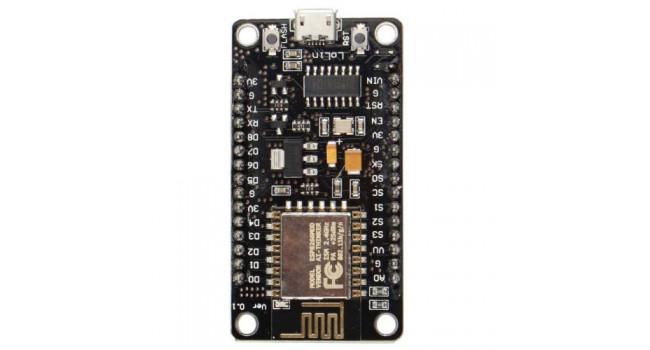
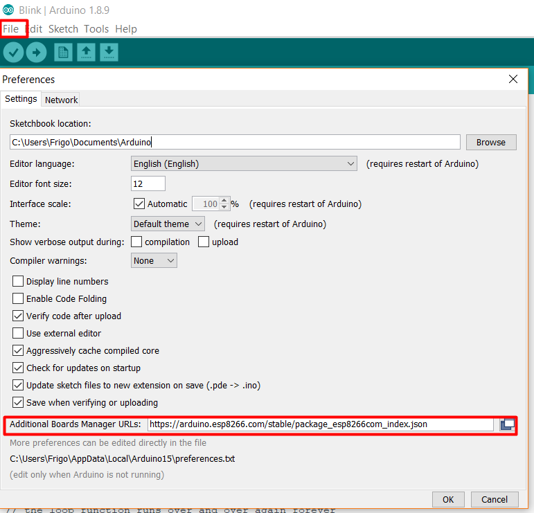
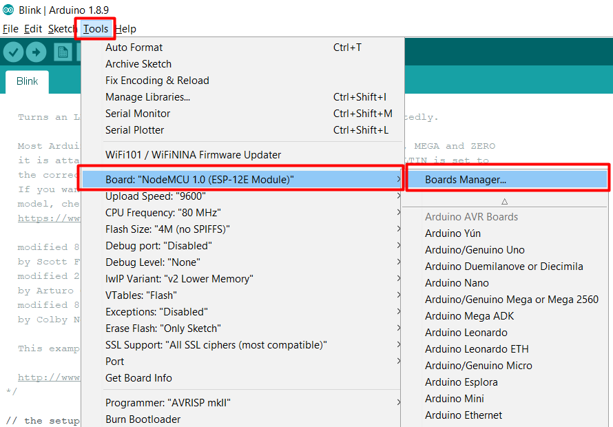
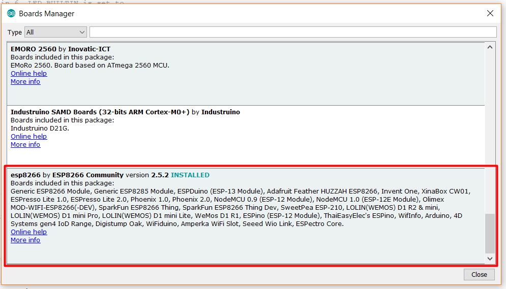
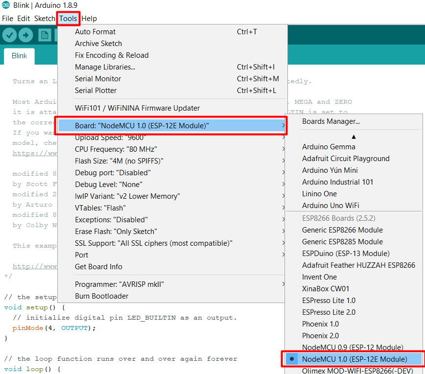
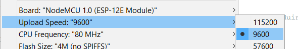
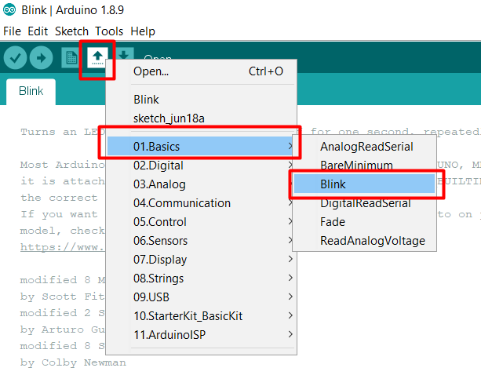
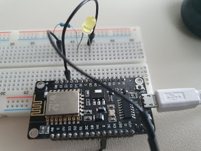

# ESP-12E

## NodeMCU

## Install (Windows)

[Windows V3.4 driver](https://wiki.wemos.cc/_media/ch341ser_win_3.4.zip)
[Arduino IDE](https://www.arduino.cc/en/Main/Software)
[Python 2.7](https://www.python.org/download/releases/2.7/)

In Arduino IDE

Go to File > Preferences

Add `https://arduino.esp8266.com/stable/package_esp8266com_index.json` to Additional Boards Manager URLs 

Go to Tools > Boards: "..." > Boards Manager 

And select esp8266 Community

## Using 

Go to Tools > Boards: "..." > NodeMCU 1.0 (ESP12-E Module)

Change Upload Speed to 9600

## First example

Select Blink application example from Arduino

Change `LED_BUILTIN` to `4`

Build the circuit of the photo to test

And upload to NodeMCU

