# Hotspot

The following guide aim to use the Raspiberry Pi as a Hotspot.

There are two differents approches, the first one the Raspi is connect to the Ethernet as a uplink. The second one the Raspi is connect to a wifi.

## Software and Hardware

Raspiberry Pi 3B

Raspibian GNU/Linux 10

Buster

Raspibian

For the wifi implementation:

Edimax EW-7811UN

## 1: Hotspot with Ethernet connection

```
sudo apt update
sudo apt install network-manager network-manager-gnome openvpn \openvpn-systemd-resolved network-manager-openvpn \network-manager-openvpn-gnome
sudo apt purge openresolv dhcpcd5
sudo ln -sf /lib/systemd/resolv.conf /etc/resolv.conf
```

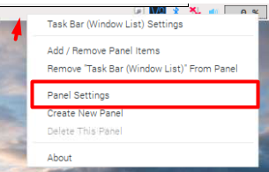

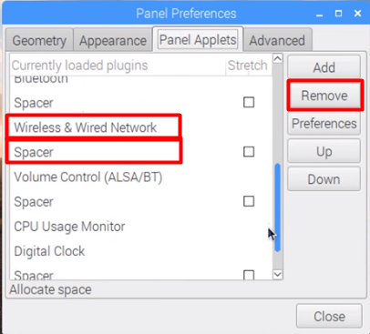

```
sudo reboot
```

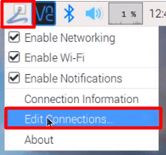

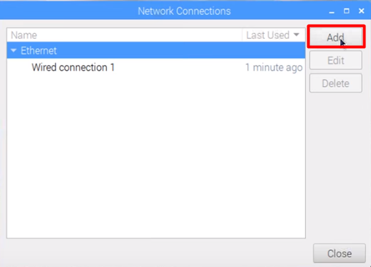

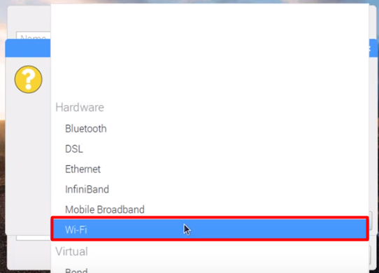

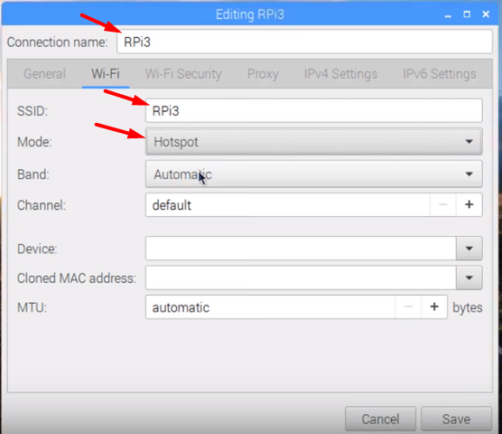

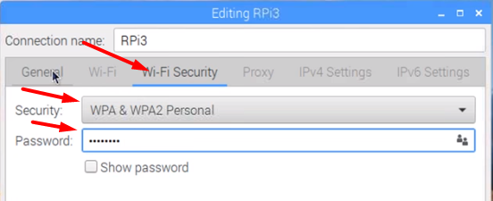

Save and Reboot

## 2.1: Hotspot with Wi-Fi connection 

It is important to note that you need a WiFi dongle because of the raspiberry hardware limitation.

"The Raspberry Pi is able to work as a wireless hotspot and simultanous connect to another hotspot as client. But the wifi device on the RasPi has a general limitation. The client connection cannot be bridged because lack of WDS (wireless distribution system) that is needed for bridging on wireless."

The WiFi dongle used is [Edimax EW-7811UN](https://www.edimax.com/edimax/merchandise/merchandise_detail/data/edimax/in/wireless_adapters_n150/ew-7811un/)

1. The following commands must be run.

```
sudo apt update
sudo apt install network-manager network-manager-gnome openvpn \openvpn-systemd-resolved network-manager-openvpn \network-manager-openvpn-gnome
sudo apt purge openresolv dhcpcd5
sudo ln -sf /lib/systemd/resolv.conf /etc/resolv.conf
```

2. Delete `Wireless & Wired Network` and the respective `Space` from Task Bar.


3. Reboot `sudo reboot`

4. Now before setting up the Hotspot you have to connect to your WiFi connection.

It is important to point that you have to connect as client to the WiFi with the WiFi dongle, because it doesn't work as a WiFi repeater (but the build in WiFi hardware on Raspi does).

You just have to click on the WiFi you want to connect on the **WiFi Networks (Edimax EW-7811Un)**, and set the correct password. 

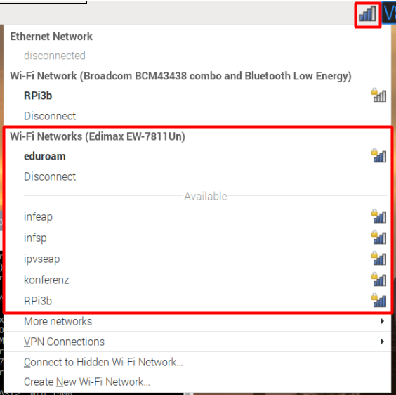

5. Now you should create the Hotspot. 

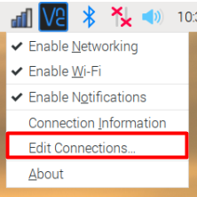
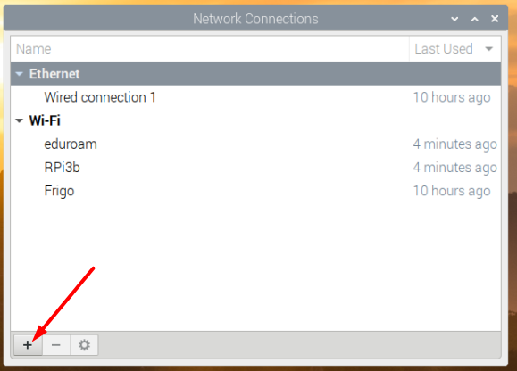
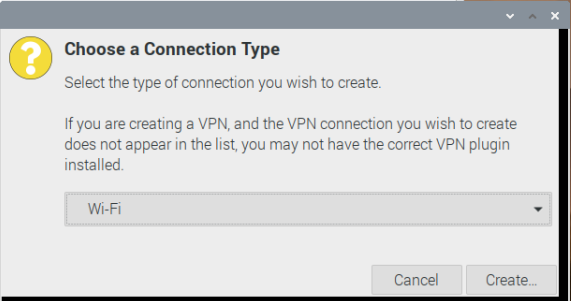

6. It is important here to setup this connection to the Raspberry Pi build in WiFi hardware. For this, you have to select the wlan that begin with **B8** in the device selector. And dont forget to select Mode as **Hotspot**.

Connection name does not matter, it is the name that gonna be shown to you.

SSID is the connection name that will be displayed.

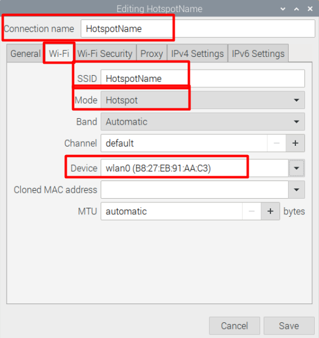

7. Set up a password for the connection.

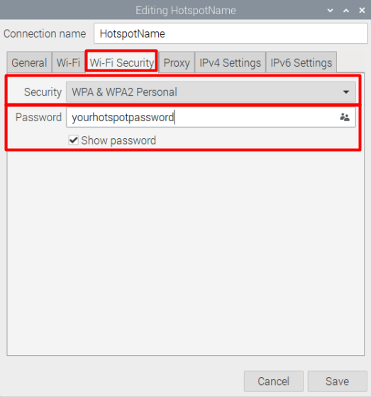

8. Set up the priority as 1, otherwise the connection as client could get the Raspberry Pi hardware and the Hotspot wont work!


9. Save and Reboot.


