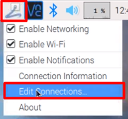
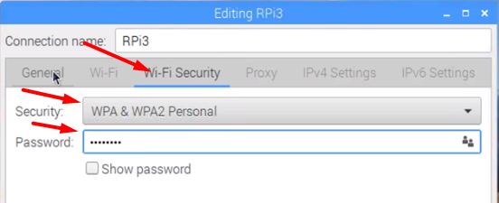

# raspberrypi3

## Utils

### How to know the MAC address knowing the interface

```cat /sys/class/net/wlan0/address```

Where wlan0 is the interface.


### How to connect on the EDUROAM on raspberry pi 3 B

Edit the following files

It could be with your favorite text editor

e.g. `sudo nano`

/etc/network/interfaces

```
source-directory /etc/network/interfaces.d

auto lo
iface lo inet loopback

iface eth0 inet manual

allow-hotplug wlan0
iface wlan0 inet manual
wpa-conf /et/wpa_supplicant/wpa_supplicant.conf
iface  default inet dhcp
```


/etc/wpa_supplicaant/wpa_supplicant.conf


``` 
ctrl_interface=DIR=/var/run/wpa_supplicabt GROUP=netdev
update_config = 1
country = GB

network={
    ssid="eduroam"
    priority=1
    key_mgmt=WPA-EAP
    auth_alg=OPEN
    eap=PEAP
    identity="YOUR ID"
    password="YOUR PASSWORD"
    phase2="auto=NONE"
}
```

Then reboot.

### Hotspot (tested with Stretch)

```
sudo apt update
sudo apt install network-manager network-manager-gnome openvpn \openvpn-systemd-resolved network-manager-openvpn \network-manager-openvpn-gnome
sudo apt purge openresolv dhcpcd5
sudo ln -sf /lib/systemd/resolv.conf /etc/resolv.conf
```


```
sudo reboot
```






Save

```
sudo reboot
```

### How to connect to vpn in raspberry pi

You can check the full guide here: [OpenConnect](https://cs.uwaterloo.ca/twiki/view/CF/OpenConnect)

First install OpenConnect:

`apt-get install openconnect network-manager-openconnect-gnome`


Then:


`sudo openconnect -u USER_ID -b VPN_ADDRESS`

Where **USER_ID** is your vpn id and
**VPN_ADDRESS** is the address for the VPN (*vpn.informatik.uni-stuttgart.de* at the moment)